## Introduction


This is a DensNet  which contains a [SE](https://arxiv.org/abs/1709.01507) (Squeeze-and-Excitation Networks by Jie Hu, Li Shen and Gang Sun) module.
Using densenet as backbone, I add senet module into densenet as pic shows below, but it's not the whole structure of se_densenet. 


Please click my **[blog](http://www.zhouyuangan.cn/2018/11/se_densenet-modify-densenet-with-champion-network-of-the-2017-classification-task-named-squeeze-and-excitation-network/)**  if you want to know more edited se_densenet details. And Chinese version blog is [here](https://zhuanlan.zhihu.com/p/48499356)

## Table of contents

- Experiment on Cifar dataset
- Experiment on my Own datasets
- How to train model
- Conclusion
- Todo

Before we start, let's known how to test se_densenet first.

```bash
cd core
python3 se_densenet.py
```

And it will print the structure of se_densenet.

Let's input an tensor which shape is (32, 3, 224, 224) into se_densenet

```bash
cd core
python3 test_se_densenet.py
```

It will print ``torch.size(32, 1000)``

## Experiment on Cifar dataset

### core/baseline.py (baseline)

- Train
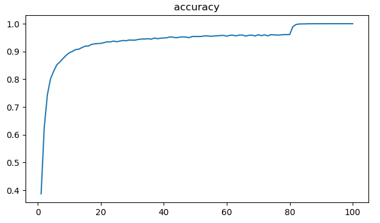
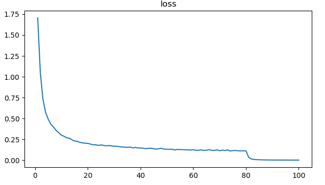

- val
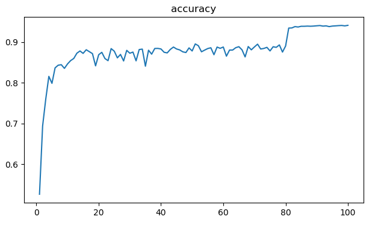
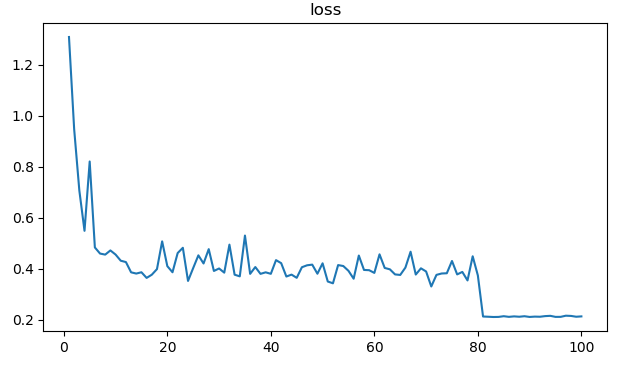

The best val acc is 0.9406 at epoch 98

### core/se_densenet_w_block.py

In this part, I removed some selayers from densenet' ``transition`` layers, pls check [se_densenet_w_block.py](https://github.com/zhouyuangan/SE_DenseNet/blob/master/se_densenet_w_block.py) and you will find some commented code which point to selayers I have mentioned above.

- train

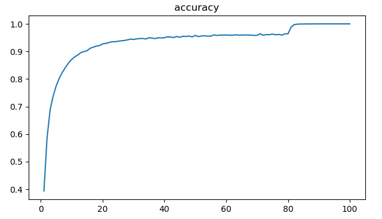
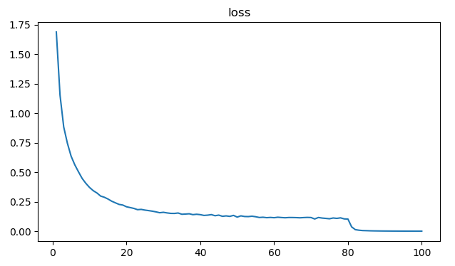

- val


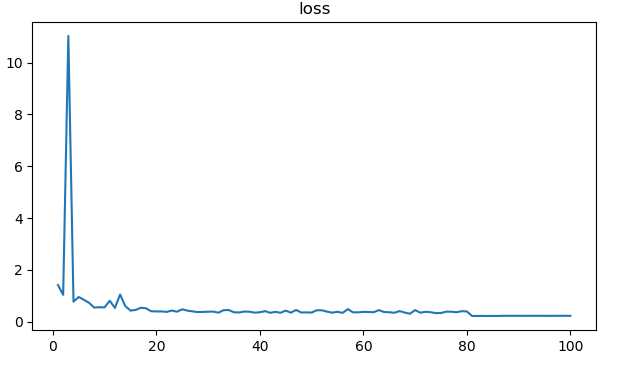

The best acc is 0.9381 at epoch 98.

### core/se_densenet_full.py

Pls check [se_densenet_full.py](https://github.com/zhouyuangan/SE_DenseNet/blob/master/se_densenet_full.py) get more details, I add senet into both denseblock and transition, thanks for [@john1231983](https://github.com/John1231983)'s issue, I remove some redundant code in se_densenet_full.py, check this [issue](https://github.com/zhouyuangan/SE_DenseNet/issues/1) you will know what I say, here is train-val result on cifar-10:

-train

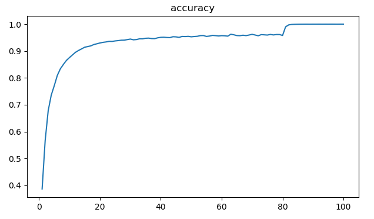
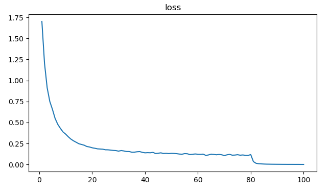

- val

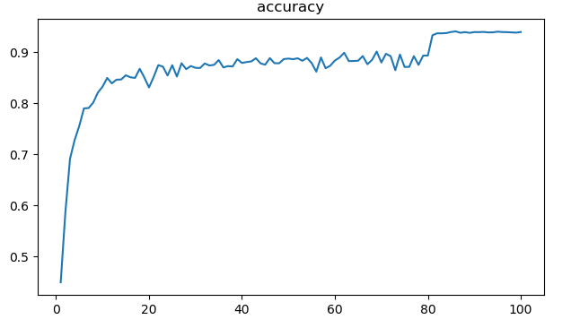
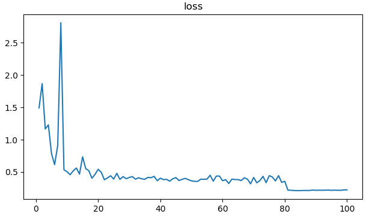

The best acc is 0.9407 at epoch 86.

### core/se_densenet_full_in_loop.py

Pls check [se_densenet_full_in_loop.py](https://github.com/zhouyuangan/SE_DenseNet/blob/master/se_densenet_full_in_loop.py) get more details, and this [issue](https://github.com/zhouyuangan/SE_DenseNet/issues/1#issuecomment-438891133) illustrate what I have changed, here is train-val result on cifar-10:

- train

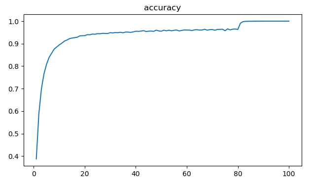
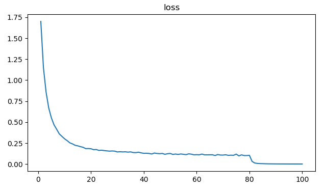

- val


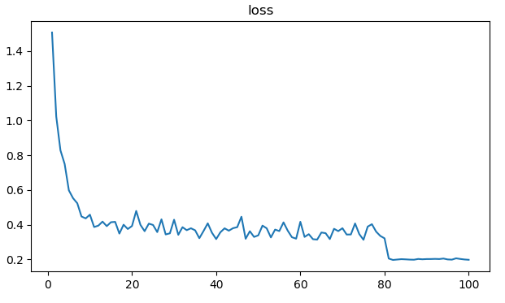

The best acc is 0.9434 at epoch 97.

### Result

|network|best val acc|epoch|
|--|--|--|
|``densenet``|0.9406|98|
|``se_densenet_w_block``|0.9381|98|
|``se_densenet_full``|0.9407|**86**|
|``se_densenet_full_in_loop``|**0.9434**|97|

## Experiment on my Own datasets


### core/baseline.py (baseline)

- train
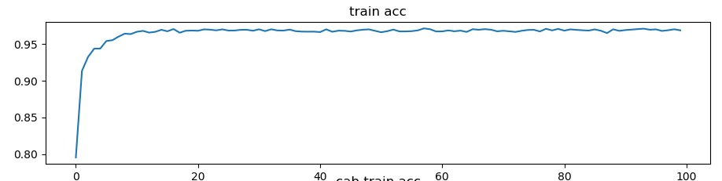
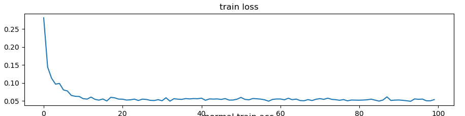

- val
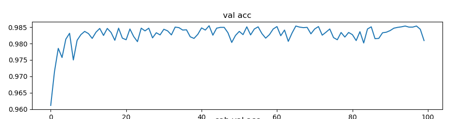
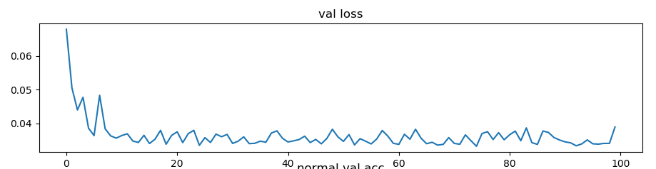

The best acc is: 98.5417%

### core/se_densenet.py

- train

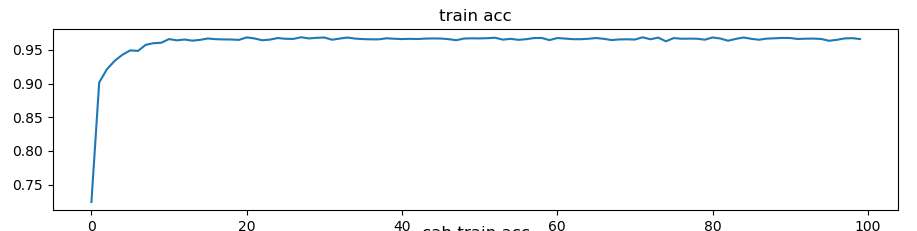


- val

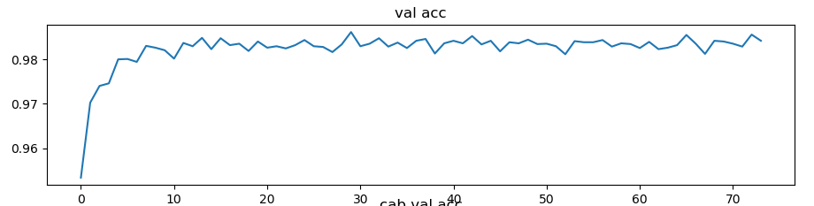
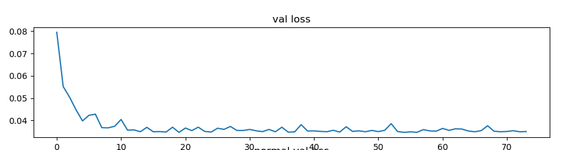

The best acc is: 98.6154%

### Result

|network|best train acc|best val acc|
|--|--|--|
|``densenet``|0.966953|0.985417|
|``se_densenet``|**0.967772**|**0.986154**|

``Se_densenet`` has got **0.0737%** higher accuracy than ``densenet``. I didn't train and test on public dataset like cifar and coco, because of low capacity of machine computation, you can train and test on cifar or coco dataset by yourself if you have the will.

## How to train model

- Download dataset

Cifar10 dataset is easy to access it's website and download it into `data/cifar10`, you can refer to pytorch official tutorials about how to train on cifar10 dataset.

- Training

There are some modules in `core` folder, before you start training, you need to edit code in `cifar10.py` file to change `from core.se_densenet_xxxx import se_densenet121`,

Then, open your terminal, type:
```bash
python cifar10.py
```

- Visualize training

In your terminal, type:

```bash
python visual/viz.py
```
Note: please change your state file path in /visual/viz.py.

### Conclusion

According to my test result:
- ``se_densenet_full_in_loop`` gets **the best accuracy** at epoch 97.
-  ``se_densenet_full`` performs well because of less epoch at 86,and it gets ``0.9407`` the second accuracy.
- In the contrast, both ``densenet`` and ``se_densenet_w_block`` get their own the highest accuracy are ``98`` epoch.

## TODO

I will release my training code on github as quickly as possible.

- [x] Usage of my codes
- [x] Test result on my own dataset
- [x] Train and test on ``cifar-10`` dataset
- [x] Release train and test code
