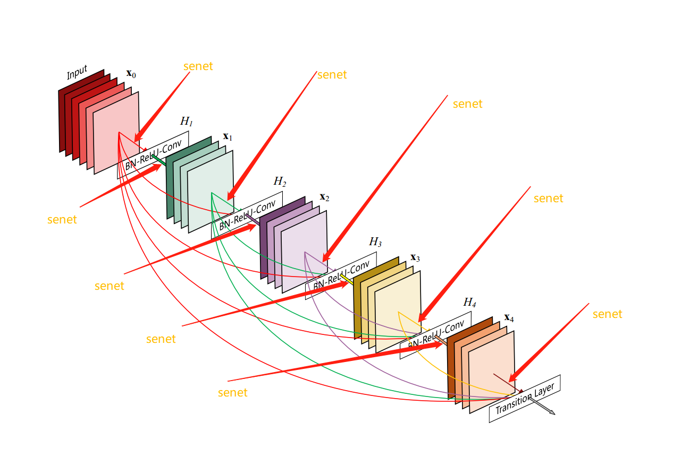

# SE_DenseNet

## Introduction
This is a DensNet  which contains a SE (Squeeze-and-Excitation Networks by Jie Hu, Li Shen and Gang Sun) module.

The backbone is densenet, I just add senet into densenet as pic-1 shows, and test on my classification task, finally, se_densenet performs better than densenet on my dataset.

pic-1:

I will update content and show my test result as quickly as possible.

## TODO
- [ ] test result
- [ ] usage of my codes